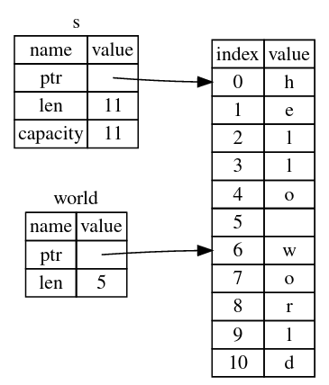

## slice

slice 类型允许你引用集合中一段连续的元素序列，而不用引用整个集合。slice 是引用。slice 对象包含首元素的引用和长度

```rust
let a = [1, 2, 3];	// [i32; 3]
let s = &a[1..];	// &[i32]
```

slice 可以是 mut 引用：

```rust
let mut a = [1, 2, 3];	// [i32; 3]
let s = &mut a[1..];	// &mut [i32]
s[0] = 99;
```

#### 字符串 slice

String 的 slice 类型为 `&str`：

```rust
let s = String::from("hello world");

let r = &s;			// &String

let all = &s[..];	// &str
let hello = &s[0..5];
let world = &s[6..];
```



slice 对象包含首元素的引用和长度，如上图。字符串 slice range 的索引必须位于有效的 UTF-8 字符边界处，否则会导致 panic。字符串 slice 也可以是 mut 引用。
