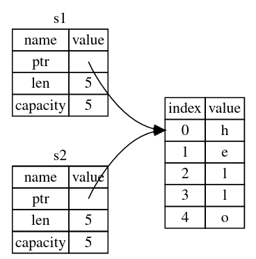

## 所有权

所有权（ownership）系统的主要目的在于管理堆上的数据。

1. Rust 中每一个值都有一个所有者（owner）
2. 值在任一时刻有且只有一个所有者
3. 当所有者（变量）离开作用域（scope），这个值将被丢弃（调用 `drop` 函数）

#### 移动

```rust
let s1 = String::from("some");
let s2 = s1;
println!("{},{}", s1, s2);	// error: borrow of moved value: `s1`
```



String 对象包含两个部分：

1. 堆上的部分，长度可变的字符串
2. 栈上的部分，指向字符串的指针、长度、容量

执行 `s2 = s1` 时，不会拷贝堆上的部分。并且在 `s2 = s1` 之后，`s1` 失效，不允许再使用。即产生了移动（move）操作。

#### 克隆

如果确实需要拷贝堆上的数据，可以使用名为 `clone` 的通用函数。克隆（clone）操作后，原先的变量仍然可用。

```rust
let s1 = String::from("some");
let s2 = s1.clone();
println!("{},{}", s1, s2);
```

#### 拷贝

对于仅存储在栈上的数据，或者实现了 `Copy` trait 注解的类型，使用 `=` 会产生拷贝（copy）操作。拷贝后，原先的变量仍然可用。

```rust
let x = 5;
let y = x;
println!("{},{}", x, y);
```

不允许自身或其任何部分实现了 `Drop` trait 的类型使用 `Copy` trait。实现 `Copy` 的类型有：

1. 整型、浮点型、布尔型、字符类型
1. 数组和元组，当且仅当其包含的类型都实现了 `Copy`

#### 参数和返回值

参数和返回值的传递与赋值过程相同：

```rust
fn take_and_give_back(s: String) -> String {
    s
}

fn main() {
    let s1 = String::from("hello");
    let s2 = take_and_give_back(s1);	// s1 移动到函数内。函数返回值移动给 s2
}	// s1, s2 离开作用域。s1 已被移动走，不做处理。s2 调用 drop。
```

## 引用和借用

引用（reference）类似于指针。引用允许你使用值但不获取其所有权。创建引用的行为称为借用（borrowing）。

```rust
fn get_len(s: &String) -> usize {
    s.len()
}	// 不会调用 drop

fn main() {
    let s1 = String::from("hello");
    let len = get_len(&s1);
    // s1 仍然可用
}
```


> 与引用相反的操作是解引用（dereferencing），使用 `*` 运算符

#### 可变引用

引用默认不可变。添加 `mut` 关键字创建可变引用。

```rust
fn change(s: &mut String) {
    s.push_str("some");
}
```

```rust
let mut s = String::from("hello");
let r1 = &mut s;
```

为了避免数据竞争，对于同一个对象，在同一时刻：

- 要么只有一个可变引用，没有其他引用
- 要么只有若干个不可变引用，没有可变引用

引用有效的范围是从声明的位置到最后一次使用，以此为标准来判断上面的“同一时刻”。

#### 悬垂

在有指针的语言中，可能存在悬垂指针问题。指即针指向的对象已经被释放。Rust 通过声明周期机制保证引用不会处于悬垂状态。
