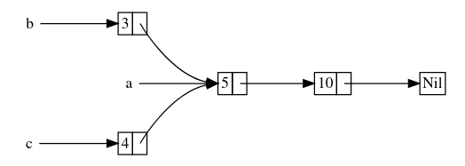

指针除了引用数据以外没有其他功能。智能指针是一类数据结构，他们的表现类似指针，但是拥有额外的元数据和功能。
在 Rust 中，普通引用（指针）和智能指针的另一个区别是，引用是一类只借用数据的指针，而智能指针通常拥有他们指向的数据。
智能指针区别于常规结构体的特性在于其实现了 `Deref` 和 `Drop` trait。Rust 中的智能指针例如 `String` （`str` 的智能指针）和 `Vec<T>`（`[T]` 的智能指针）。

## `Box<T>`

最基本的智能指针，允许将值放在堆上而不是栈上。栈上只存放指针。常用于：

- 当有一个在编译时未知大小的类型，而又想要在需要确切大小的上下文中使用这个类型值的时候
- 当有大量数据并希望在确保数据不被拷贝的情况下转移所有权的时候
- 当希望拥有一个值并只关心它的类型是否实现了特定 trait 而不是其具体类型的时候

可以通过 `Box<T>` 得到指向对象的可变/不可变引用。当 `Box` 离开作用域时，将释放其自身和其指向的对象。

#### 递归类型

Rust 中需要借助 `Box<T>` 才能创建递归类型。例如一个链表：

```rust
enum List {
    Cons(i32, Box<List>),
    Nil,
}

let l = Cons(1, Box::new(Cons(2, Box::new(Nil))));
```

## `Deref` trait

智能指针需要实现的 trait，它重载了解引用运算符，使得智能指针可以像普通指针一样使用

```rust
pub trait Deref {
    type Target: ?Sized;
    fn deref(&self) -> &Self::Target;	// 注意这里返回的是引用，为了避免将所有权移动出去
}
```

对一个实现 `Deref` 的对象 `b` 使用解引用运算符时，会发生这样的替换：`*b` 替换为 `*(b.deref())`。注意外面仍有一个解引用运算符，因为 `deref()` 返回的是目标对象的引用。

> 与其叫 `deref`，不如叫 `desmart`。因为这个函数把智能指针转换成普通指针（引用）

#### `Deref` 强制转换

Rust 会在实现了 `Deref` trait 的类型上自动调用任意次的 `deref()`，以使类型匹配：

```rust
fn fun(s: &str) {
    todo!()
}

let b = Box::new(String::new());
fun(&b);	// &Box<String> -> &String -> &str
```

#### `DerefMut` trait

```rust
pub trait DerefMut: Deref {
    fn deref_mut(&mut self) -> &mut Self::Target;
}
```

用于从可变的智能指针获得对象的可变引用

## `Drop` trait

`drop` trait 允许我们在值要离开作用域时执行一些代码，例如释放内存、文件、网络资源等。智能指针都实现了 `Drop`。

```rust
pub trait Drop {
    fn drop(&mut self);
}
```

`drop()` 方法不允许手动调用。如果需要提前释放资源，可以使用 `std::mem::drop` 函数（包含在 prelude 中）：

```rust
drop(x);
```

## `Rc<T>` 引用计数

注意 `Rc<T>` 只能用于单线程场景

```rust
enum List {
    Cons(i32, Rc<List>),
    Nil,
}

use crate::List::{Cons, Nil};
use std::rc::Rc;

fn main() {
    let a = Rc::new(Cons(5, Rc::new(Cons(10, Rc::new(Nil)))));
    let b = Cons(3, Rc::clone(&a));
    let c = Cons(4, Rc::clone(&a));
}
```

这创建了一个如下所示的链表：



`Rc<T>` 的 `clone` 与大多数类不同，不会进行深拷贝，仅会浅拷贝并增加计数。常用 `Rc::clone(&a)` 而不是 `a.clone()` 以体现其中的区别。`Rc<T>` 被 `drop()` 时计数减少。计数为零时释放资源

由于可以有多个 `Rc<T>` 指向同一对象，`Rc<T>` 没有实现 `DerefMut`，不允许通过 `Rc<T>` 对对象进行可变访问。

## `RefCell<T>`

`RefCell<T>` 与 `Box<T>` 一样，只能有单一所有者。`RefCell<T>` 只能用于单线程场景。`RefCell<T>` 的特点是允许在运行时执行借用检查，而且即使在 `RefCell<T>` 本身不可变的情况下仍允许改变其内部的值，即**内部可变性**模式。如果在运行时违反了借用规则，会产生 panic。

```rust
let s = String::new();
let sr = RefCell::new(s);
sr.borrow_mut().push_str("hi");
println!("{}", sr.borrow());
```

`borrow` 方法返回 `Ref<T>` 类型的智能指针，`borrow_mut` 方法返回 `RefMut<T>` 类型的智能指针。`RefCell<T>` 会记录当前有多少个活动的 `Ref<T>` 和 `RefMut<T>` 智能指针，以此执行运行时的借用检查，有少量性能损失。

## `Rc<T>` + `RefCell<T>`

为了解决 `Rc<T>` 不能可变访问的问题，常常结合使用 `Rc<T>` 和 `RefCell<T>`：

```rust
enum List {
    Cons(Rc<RefCell<i32>>, Rc<List>),
    Nil,
}
```

## 引用循环

在 Rust 中，引用循环会导致内存泄漏。例如：

```rust
#[derive(Debug)]
struct Node(Option<RefCell<Rc<Node>>>);

let a = Rc::new(Node(Some(RefCell::new(Rc::new(Node(None))))));
let b = Rc::new(Node(Some(RefCell::new(a.clone()))));
if let Some(r) = &a.0 {
    *r.borrow_mut() = b.clone();
}
println!("{:?}", a);	// 会导致栈溢出
```

一种解决方案是重新组织数据结构，使得一部分引用拥有所有权而另一部分没有。具体参考 the book
