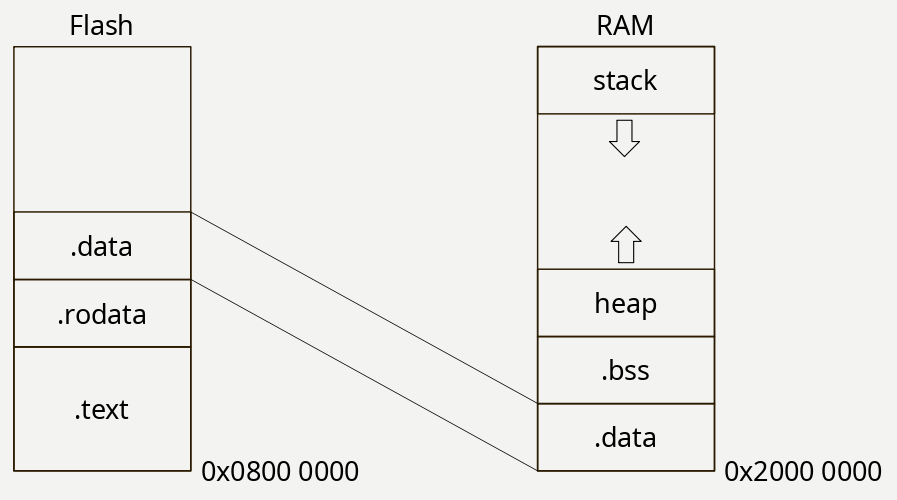

启动文件的任务:

1. 设置中断向量表
2. 初始化 SRAM 中的 .data 和 .bss 段
3. 如果使用标准库的话, 调用 `__libc_init_array()` 以初始化标准库
4. 调用 `main()`

### 中断向量表

- 初始 MSP 值

- 15个系统异常（包括 `Reset_Handler`）

- n个IRQs

总共占用 \\( (1+15+n)\times4\ {byte} \\).

### 复位流程

参考 ARM 架构部分的笔记。

1. 从 `0x0000_0000` 取 MSP
2. 从 `0x0000_0004` 取 `Reset_Handler` 到 PC
3. 执行 `Reset_Handler` 函数

### 初始化 .data 和 .bss

在 Reset_Handler 里初始化 SRAM 中的 .data 和 .bss 段

.data 段复制到 SRAM 中, .bss 段清空

